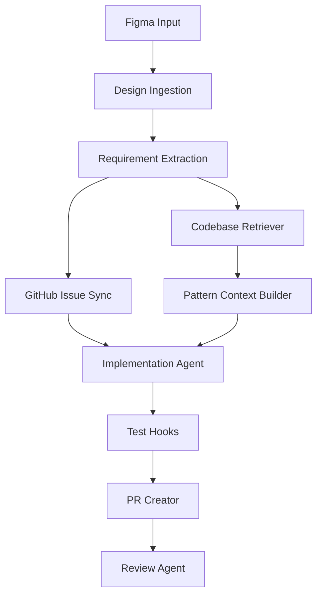

# Backend Power

**Backend Power** is an agentic backend delivery workflow that turns design references into traceable engineering work, retrieves similar implementations from the existing codebase, and helps generate repository-consistent patches, tests, and pull requests.

It is built for teams that want AI assistance across backend delivery without letting generated code drift away from existing architecture and team conventions.

## Why Backend Power?

Most design-to-code tools focus on frontend scaffolding. Backend delivery is different.

A backend implementation usually needs more than UI interpretation:
- existing domain boundaries
- API conventions
- database migration patterns
- validation and error handling rules
- test structure
- repository-specific coding style

Backend Power focuses on **design-to-backend delivery**, not generic greenfield code generation.

## Core ideas

### 1. Design should map to engineering work
Backend Power links design references such as Figma frames or flows to backend work items such as GitHub Issues.

### 2. Generated code must be grounded in the repository
Before proposing changes, Backend Power retrieves similar endpoints, services, migrations, tests, and patterns from the existing codebase.

### 3. Prefer extension over invention
The system should extend current modules and conventions whenever possible instead of introducing isolated abstractions.

### 4. Traceability matters
A change should be explainable across:
- design reference
- issue
- code change
- pull request
- test result

## V1 scope

Backend Power V1 focuses on:
- Figma reference ingestion
- GitHub Issue creation with design linkage
- repository similarity retrieval
- backend implementation planning
- patch-oriented code generation
- test execution hooks
- pull request creation
- AI-assisted PR review

## Non-goals for V1

Backend Power V1 does not aim to provide:
- autonomous production deployment
- Jira integration
- multi-repo orchestration
- fully autonomous delivery without review

## Example workflow

1. Read a Figma file reference and node
2. Extract backend-relevant requirements
3. Create or enrich a GitHub Issue
4. Retrieve similar code from the repository
5. Build repository-native implementation guidance
6. Generate a patch proposal
7. Run test hooks
8. Open a pull request
9. Review for correctness and style drift

## Architecture at a glance



## Design principles

- traceability first
- repository-grounded generation
- patch-oriented changes
- prefer existing patterns over new abstractions
- keep human review in the loop

## Repository structure

```text
backend-power/
├── README.md
├── docs/
├── cmd/
├── internal/
│   ├── design/
│   ├── planning/
│   ├── tracker/
│   ├── retrieval/
│   ├── agent/
│   ├── execution/
│   ├── policy/
│   ├── trace/
│   └── api/
├── pkg/
├── prompts/
├── templates/
├── migrations/
├── testdata/
└── .github/
```

## Planned components

- **design ingestion**: parse Figma references into structured backend signals
- **work item planning**: derive backend tasks from design context
- **GitHub issue sync**: create issues with traceable design linkage
- **codebase retrieval**: find similar implementations in the existing repository
- **pattern context builder**: extract naming, layering, migration, and testing conventions
- **implementation agent**: generate patch-oriented changes using repository-native patterns
- **review agent**: detect style drift, missing tests, duplication, and risky changes

## Suggested use cases

- turn a Figma checkout flow into backend work items
- enrich GitHub Issues with API, DB, and validation scope
- generate implementation drafts based on similar existing modules
- review pull requests for repository consistency

## Status

This project is in early design / MVP stage.

## Roadmap

- [ ] Figma design reference model
- [ ] GitHub Issue adapter
- [ ] design-to-work-item extraction
- [ ] traceability persistence model
- [ ] code similarity retrieval
- [ ] pattern context builder
- [ ] patch-oriented generation flow
- [ ] pull request creation
- [ ] review checklist engine

## Contributing

Contributions, ideas, and architecture discussions are welcome.

## License

TBD
