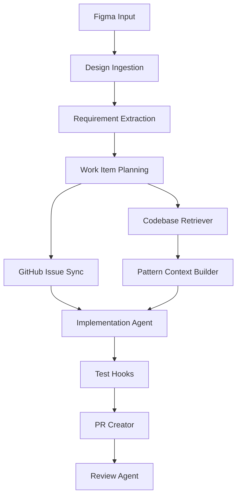

# Architecture

## Goal

Backend Power is designed to help backend teams move from design references to repository-grounded implementation.

The system is not intended to generate isolated greenfield code. Its purpose is to create traceable backend work items, retrieve similar examples from the existing codebase, and assist implementation in a way that matches repository-native patterns.

## High-level flow

## Components

### Design Ingestion
Reads Figma references and extracts structured design metadata.

### Requirement Extraction
Transforms design signals into backend-relevant requirements such as entities, commands, validations, state transitions, permissions, and side effects.

### Work Item Planning
Converts extracted requirements into engineering work items such as API changes, domain logic, database updates, and test scope.

### GitHub Issue Sync
Creates or enriches GitHub Issues and links them to design references.

### Codebase Retriever
Finds similar endpoints, services, migrations, tests, and prior implementation patterns from the existing repository.

### Pattern Context Builder
Builds repository-native guidance from retrieved examples, including naming, layering, transaction style, migration patterns, and testing conventions.

### Implementation Agent
Generates patch-oriented changes that prefer extending current modules over introducing new abstractions.

### Test Hooks
Runs lint, unit tests, integration tests, or local validation workflows where applicable.

### PR Creator
Creates a pull request with linked work item, design reference, implementation summary, and verification notes.

### Review Agent
Checks for correctness, missing tests, style drift, duplicated abstractions, and repository mismatch.

## Design principles

- Traceability first
- Repository-grounded generation
- Prefer extension over invention
- Patch-oriented implementation
- Human review stays in the loop

## Traceability chain

A change should be explainable through this chain:

`Figma node -> GitHub Issue -> patch -> pull request -> test evidence`

## V1 boundaries

Included in V1:
- Figma reference ingestion
- GitHub Issue creation
- repository similarity retrieval
- implementation planning
- patch-oriented code generation
- test hooks
- PR creation
- review assistance

Excluded from V1:
- Jira integration
- autonomous production deployment
- multi-repo orchestration
- automated issue closure based on deployment events
